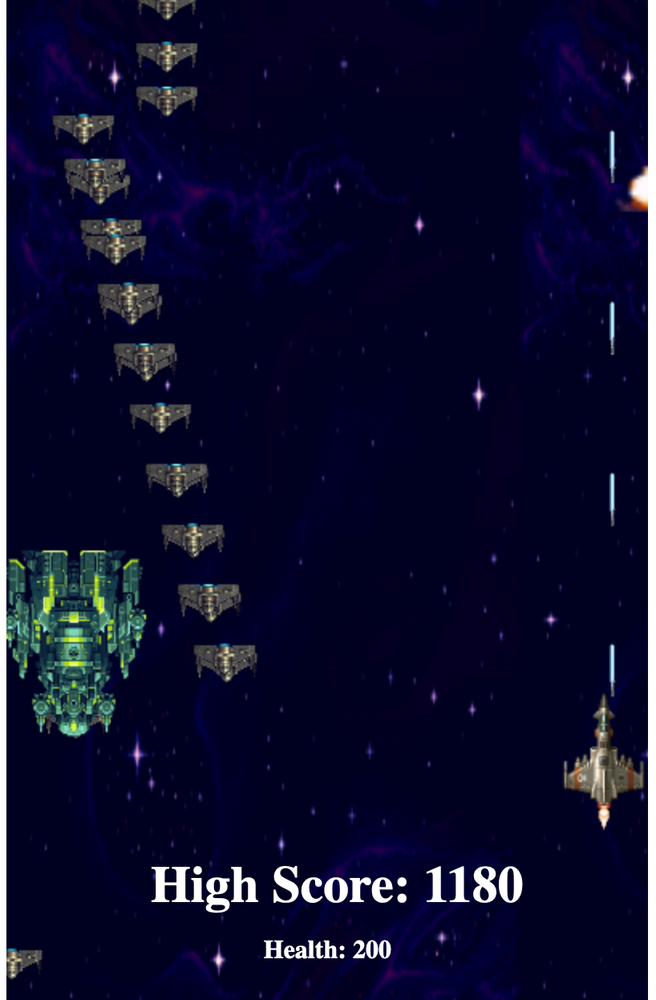

# 3.3 Checking Development Tests

These are a collection of the tests that add to the overall player experience and are relevant to the success criteria. They are tests based on each development in each cycle and they are designed to test that the new features work as intended and that they all work in this final version of the game, before future development outside of this project.&#x20;

They are in chronological order as they are in the cycles, except that they are all in one table.&#x20;

## Tests

| Test | Instructions                                   | What I expect                                                                                                           | Pass/Fail |
| ---- | ---------------------------------------------- | ----------------------------------------------------------------------------------------------------------------------- | --------- |
| 1    | Run code                                       | Page to load and be rendered to fit the screen.                                                                         | Pass      |
| 2    | Press the WASD keys                            | Arrow keys allow basic movement of sprite on page.                                                                      | Pass      |
| 3    | Press the WASD keys                            | The player to move to the edge of the screen and go no further                                                          | Pass      |
| 4    | Run code                                       | Enemy spawns                                                                                                            | Pass      |
| 5    | Background music                               | Music begins as soon as the game starts                                                                                 | Pass      |
| 6    | Shoot enemy                                    | Enemy explodes with laser impact                                                                                        | Pass      |
| 7    | Survive long enough to get the special enemies | The special enemies spawn in, move faster and basic enemies aren't spawned for duration.                                | Pass      |
| 8    | Run code, and make it far enough into game     | Health to be added and shown on screen                                                                                  | Pass      |
| 9    | Shoot an enemy                                 | The score displayed on screen gets 10 added to it                                                                       | Pass      |
| 10   | Collect health                                 | When health is picked up, your score gets 10 added to it                                                                | Pass      |
| 11   | Crash the player ship                          | The menu should appear and so should the restart button. The restart button should glow yellow when you hover over it.  | Pass      |

## Evidence

<figure><figcaption>
Test 1 - Player loaded in
</figcaption></figure>

<figure><figcaption>
Test 2 - Ability to move side to side
</figcaption></figure>

<figure><figcaption>
Boundaries working as expected
</figcaption></figure>

<figure><figcaption>
Test 4 - Enemy wave spawns in
</figcaption></figure>

<figure><figcaption>
Test 5 - Sounds Added to game
</figcaption></figure>

<figure><figcaption>
Test 6 - Enemies exploding from lasers
</figcaption></figure>

<figure><figcaption>
Test 7 - Much larger enemy boss
</figcaption></figure>

<figure><figcaption>
Test 8 - Health spawning into game
</figcaption></figure>

<figure><figcaption>
Test 10  - Adding high score and health to UI
</figcaption></figure>

<figure><figcaption>
Test 11 - Enemy exploding when health drops to 0
</figcaption></figure>

## Final Project Result

This is a video of the game fully working and running as intended after all development tests have been completed and rerun to double check.&#x20;


