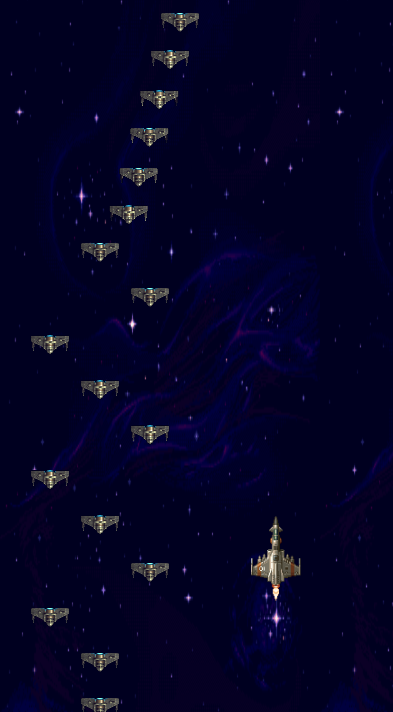

# 2.2.9 Cycle 9 - Add Counters

## Design

### Objectives

In this cycle I aim to add a score count, which changes based on the number of enemies shot, and the different types of enemies that have been shot. It'll also give more points to the player if they pick up health. This gives another incentive for the player to pick up health and will mean that they can boost their score by picking up items.

Additionally I added the ability for the game to store the highscore locally which means that when the player comes back the next time they play, their previous best score is stored, and this allows the player to try and beat their best, without having to write it down themselves, or remeber it. This makes the game more likely to keep the player playing as it is more easy to come back to and try and beat their previous score.&#x20;

Lastly I will also add an onscreen counter for health, which will glow yellow when health is gained. This will make it more obvious when health is gained, and will make it easier to keep track of. This improves the player's experience in the game as it means they aren't constantly looking back and forth for their health.&#x20;

* [x] Add score count on screen
* [x] Add a method that adds the score
* [x] Store the high score locally
* [x] Add high score on screen
* [x] Add health on screen

### Usability Features

### Key Variables

| Variable Name | Use                                                                                                                                                        |
| ------------- | ---------------------------------------------------------------------------------------------------------------------------------------------------------- |
| score         | This is the variable that holds the score.                                                                                                                 |
| newHighScore  | This is the variable that is stored locally to hold the high score from each play they have. This gets overwritten when they score higher than previously. |
| health        |                                                                                                                                                            |

### Pseudocode

```
procedure increaseScore
  score += 10
  scoreText = "Score: score"
  if score > newHighscore then newHighscore = score  
  highscore = "High Score: newHighscore";
  set 'High-Score' to newHighscore); // Set highscore in local storage
end procedure

procedure increaseHealth
  health += 50
  run increaseScore procedure
  play sound 'health increase'
  healthText = `Health: health`;
  healthText glow
end procedure
```

## Development

### Outcome




```javascript
//Function increaseScore increases the players score by 10 and changes the high score variable in index.html
function increaseScore() {
  score += 10;
  scoreText.innerHTML = `Score: ${score}`;
  if (score > newHighscore) {
    newHighscore = score;
  }
  const highscore = document.querySelector('.highscore');
  highscore.innerHTML = `High Score: ${newHighscore}`;
  localStorage.setItem('High-Score', newHighscore); // Set highscore in local storage
}

// Function increaseHealth adds to the players health and starts the glow animation for health in the index.html
function increaseHealth(healthPickup) {
  healthPickup.kill();
  health += 50;
  increaseScore();
  let healthSoundSE = game.add.sound('healthGet');
  healthSoundSE.play();
  healthText.innerHTML = `Health: ${health}`;
  healthText.classList.add('glowText');
  setInterval(function() {
    healthText.classList.remove('glowText');
  }, 800);
}
```





```html
<div class="outside-game">    
        <div id="game-wrapper">
                <h1 class="score">Score: 0</h1>
                <h1 class="gameover">GAME OVER</h1>
                <div class="restart display-none">RESTART</div>
                <h5 id="health">Health: 200</h5>
        </div>
        <div class="highscore-div">
            <h1 class="highscore">High Score: </h1>
        </div>
        <div class="game"></div>
        <footer>Created by Jack Foot</footer>
</div>
```




### Challenges

It was challenging to get the score to be detected as a variable for the innerHTML as it kept saying that the variable was null. I used breakpoints to be able to identify what was happening in the program and found that.

I also have two index.html files in the game, which made it confusing as to which I should put html code into, and this caused the issue with the null variables with health and score, as they were trying to refer to the health HTML element but that didn't exist in the index.html it was looking at.&#x20;

## Testing

Evidence for testing

### Tests

<table><thead><tr><th>Test</th><th>Instructions</th><th>What I expect</th><th>What actually happens</th><th data-type="select">Pass/Fail</th></tr></thead><tbody><tr><td>1</td><td>Shoot an enemy</td><td>The score displayed on screen gets 10 added to it</td><td>The score is null and isn't shown on screen</td><td></td></tr><tr><td>2</td><td>Shoot an enemy</td><td>The score displayed on screen gets 10 added to it</td><td>As expected</td><td></td></tr><tr><td>3</td><td>Collect health</td><td>When health is picked up, your score gets 10 added to it</td><td>As expected</td><td></td></tr></tbody></table>

### Evidence

<figure><figcaption><p>Shows the score, health and previous high score</p></figcaption></figure>
